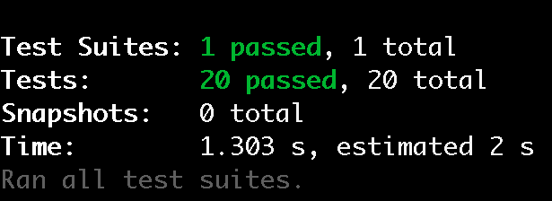

# event-counter

To use EventCounter library

## Import

``` javascript
import { EventCounter } from './event-counter';
```

### Syntax
#### EventCounter
```
const eventCounter = new EventCounter(eventName)
```
##### Parameter Value
| Parameter |Description |
| ------------- | ------------- |
| eventName: String  | Optional. The name of the event counter. Defaults to `event` |

#### getCount
```
eventCounter.getCount(timeWindow)
```
##### Parameter Value
| Parameter  | Description |
| ------------- | ------------- |
| timeWindow: Number | Optional. The amount of time until current time in seconds. Defaults to `300`|

#### incrementCount
```
eventCounter.incrementCount()
```

##### Parameter Value
None

## Usage 
```javascript
// t = 0 (s), events = []
const eventCounter = new EventCounter();    //
eventCounter.getCount()                     // return 0

// t = 0 (s), events = [T0]
eventCounter.incrementCount();              // return "event just happened"
eventCounter.getCount()                     // return 1

// after 1 minute (60 seconds)
// t = 60 (s),  events = [T0, T60]
eventCounter.incrementCount();              // return "event just happened"

// return the number of events that happened in 30 seconds
eventCounter.getCount(30)                   // return 1

// after 5 minutes (300 seconds)
// t = 300 (s), events = [T0, T60]
eventCounter.getCount()                     // return 2                    

// after 5 minutes and 1 second (301 seconds)
// t = 301 (s), events = [T60]
eventCounter.getCount()                     // return 1

// Option to name the eventcounter
const searchCounter = EventCounter('search request');   //
searchCounter.incrementCount();                         // return "search request just happened"
```

## Test
All the test cases in `counter.test.js`

To run the test

```
npm test
```


